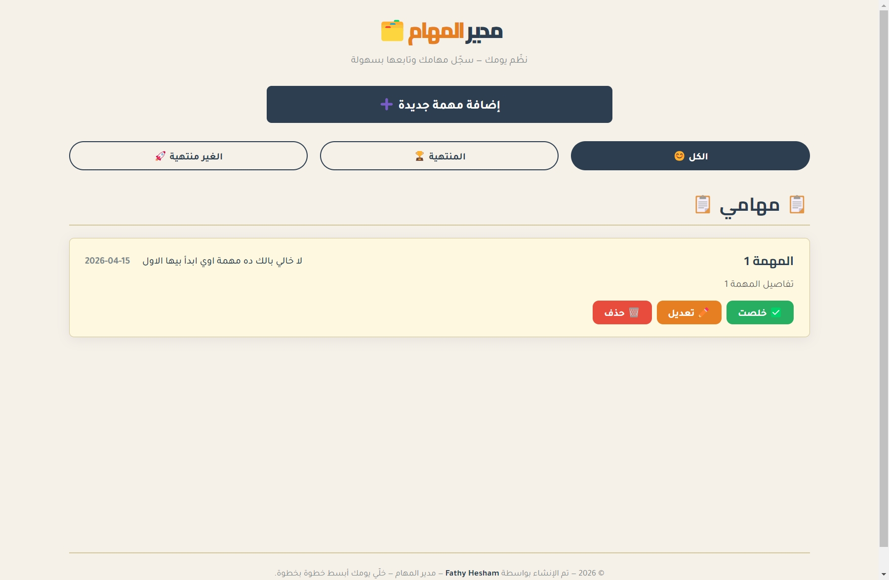
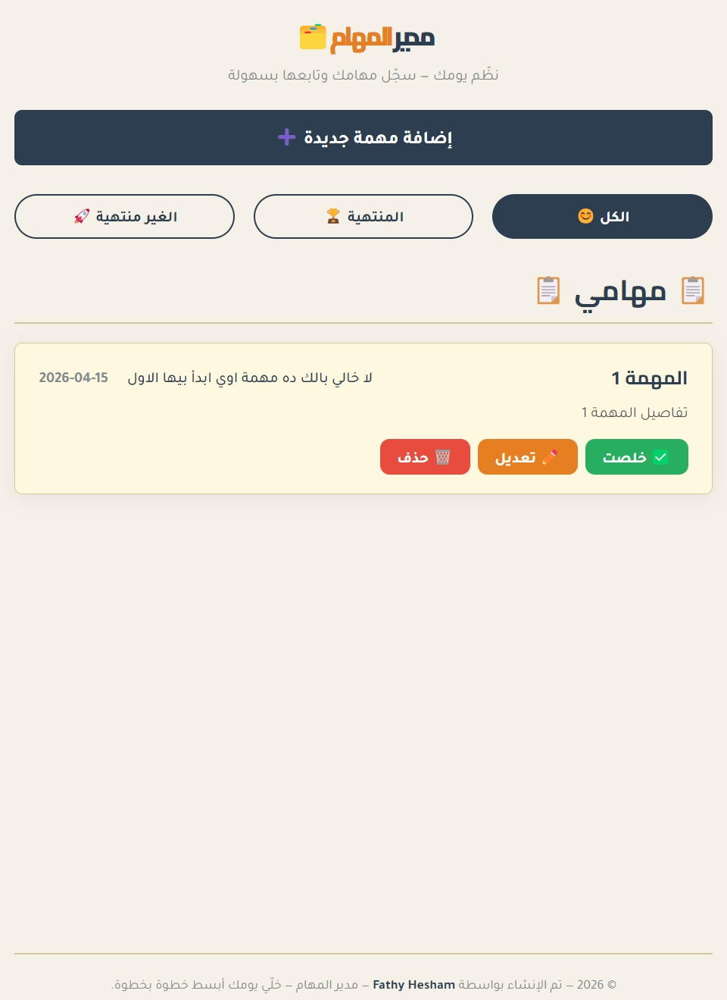
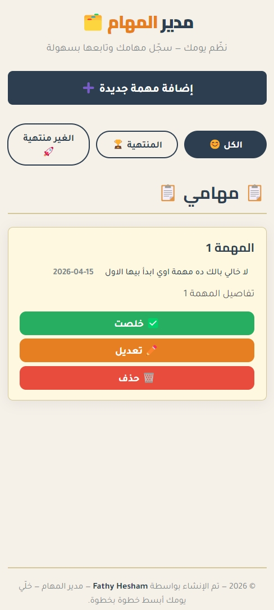

# 🗂️ مدير المهام — To-Do List Application v3.0

<div align="center">

A **full-featured Arabic Task Manager** built with **React 19 + TypeScript + Vite**.
Upgraded from a vanilla TypeScript app to a modern React architecture with Context API, Custom Hooks, and persistent LocalStorage.

[](https://react.dev/)
[](https://www.typescriptlang.org/)
[](https://vite.dev/)

</div>

---

## 📸 Screenshots

### 📸💻 Laptop View

> 

### 📸📟 Tablet View

> 

### 📸📱 Phone View

> 

---

## 🚀 Live Demo — v3.0

- 🔗 **Live Demo:** (<https://to-do-list-application-v3-0.vercel.app/>)

---

## 🔗 Previous Versions

| Version | Tech Stack | Live Demo | Repository |
|---------|-----------|-----------|------------|
| **v1.0** | Vanilla JavaScript | [▶ Demo](https://fathyhesham.github.io/TO-DO-List-Application-v1.0/) | [📁 Repo](https://github.com/FathyHesham/TO-DO-List-Application-v1.0) |
| **v2.0** | TypeScript + OOP | [▶ Demo](https://fathyhesham.github.io/To-Do-List-Application-v2.0/) | [📁 Repo](https://github.com/FathyHesham/To-Do-List-Application-v2.0) |
| **v3.0** | React + TypeScript + Vite | [▶ Demo](https://to-do-list-application-v3-0.vercel.app/) | [📁 Repo](https://github.com/FathyHesham/TO-DO-List-Application-v3.0) |

---

## 📦 Project Versions Evolution

### 🔹 v1.0 — Initial Release

- Built with **Vanilla JavaScript**
- Basic DOM manipulation
- Core to-do functionality
- Single-file structure

### 🔹 v2.0 — TypeScript Refactor

- Rebuilt using **TypeScript**
- Applied **OOP principles** (Classes & Generics)
- Clean separation: Business Logic / UI / DOM
- Modular file-based structure

### 🔹 v3.0 — React Upgrade *(Current)*

- Full migration to **React 19** with component-based architecture
- **Context API** for global state management (no Prop Drilling)
- **Custom Hooks** for clean context access
- **useMemo** for optimized task filtering
- Persistent data via **LocalStorage** with auto-sync
- Arabic-first UI with full RTL support
- Priority-based color system per task card

---

## ✨ Features

| Feature | Description |
|---------|-------------|
| ➕ **Add Tasks** | Create tasks with title, description, due date & priority |
| ✏️ **Edit Tasks** | Update any task's details through a modal form |
| ✅ **Complete Tasks** | Toggle tasks between active and completed |
| 🗑️ **Delete Tasks** | Remove tasks permanently |
| 🔍 **Filter Tasks** | Filter by All / Active / Completed |
| 💾 **Persistent Storage** | All tasks saved in LocalStorage automatically |
| 🎨 **Priority Styling** | Visual color-coding for Low / Medium / High priority |
| 📭 **Empty State** | Friendly message when no tasks are available |
| 🌐 **Arabic UI** | Fully Arabic interface with RTL layout |

---

## 🏗️ Project Architecture

```plaintext
TO-DO-List-Application-v3.0/
│
├── index.html
├── package.json
├── vite.config.ts
├── tsconfig.json
│
└── src/
    ├── main.tsx                 ← App entry point + Provider setup
    ├── App.tsx                  ← Root component (filter, modal state)
    │
    ├── Components/
    │   ├── CardTask.tsx         ← Single task card (complete, edit, delete)
    │   ├── FilterButtons.tsx    ← All / Active / Completed filter tabs
    │   ├── ListTasks.tsx        ← Task list renderer + empty state
    │   └── ModelTask.tsx        ← Add / Edit modal form
    │
    ├── Contexts/
    │   └── TasksContext.tsx     ← Global state + CRUD operations
    │
    ├── Hooks/
    │   └── useTasks.ts          ← Custom Hook for safe Context access
    │
    ├── Types/
    │   └── TypesTask.ts         ← All TypeScript interfaces & types
    │
    ├── Utils/
    │   └── LocalStorage.ts      ← load/save helpers for LocalStorage
    │
    └── Styles/
        ├── App.css
        ├── CardTask.css
        ├── FilterButton.css
        ├── ListTask.css
        └── ModelTask.css
```

---

## 🛠️ Technologies Used

- **React 19** *(Components – Context API – Hooks – useMemo)*
- **TypeScript 6** *(Interfaces – Type Aliases – Generics)*
- **Vite 8** *(Dev server – HMR – Fast builds)*
- **HTML5 / CSS3**
- **LocalStorage API**

---

## 🎯 Technical Highlights

- ✅ **Context API** — global state shared across components without Prop Drilling
- ✅ **Custom Hook** (`useTasksContext`) — safe Context access with descriptive errors
- ✅ **useMemo** — filtered tasks only recompute when `tasks` or `filter` changes
- ✅ **Lazy State Initializer** — `useState(() => loadTasks())` loads LocalStorage once
- ✅ **useEffect auto-sync** — every state change automatically persists to LocalStorage
- ✅ **Dual-mode Modal** — same component handles both Add and Edit workflows
- ✅ **Strict TypeScript** — fully typed props, state, context, and event handlers
- ✅ **Separation of Concerns** — Types / Utils / Context / Hooks / Components each in own layer

---

## ⚙️ Installation & Setup

### 1️⃣ Prerequisites

Make sure you have installed:

- **Node.js (LTS)** — [https://nodejs.org/](https://nodejs.org/)

Verify:

```bash
node -v
npm -v
```

---

### 2️⃣ Clone the Repository

```bash
git clone https://github.com/FathyHesham/TO-DO-List-Application-v3.0.git
cd TO-DO-List-Application-v3.0
```

---

### 3️⃣ Install Dependencies

```bash
npm install
```

---

### 4️⃣ Run Development Server

```bash
npm run dev
```

Open your browser at: `http://localhost:5173`

---

### 5️⃣ Build for Production

```bash
npm run build
```

Output will be in the `dist/` folder.

---

### 6️⃣ Preview Production Build

```bash
npm run preview
```

---

## 📜 Available Scripts

| Script | Command | Description |
|--------|---------|-------------|
| Dev Server | `npm run dev` | Start local development with HMR |
| Build | `npm run build` | Compile TypeScript + bundle for production |
| Preview | `npm run preview` | Preview the production build locally |
| Lint | `npm run lint` | Run ESLint checks |

---

## 🔄 Data Flow Overview

```
TasksProvider (Context)
      │
      └── App.tsx
            ├── FilterButtons  →  updates filter state
            ├── ListTasks      →  receives filtered tasks
            │     └── CardTask →  reads Context directly (delete, complete)
            └── ModelTask      →  reads Context directly (add, update)
```

---

## 📈 Future Improvements

- [ ] Search bar to find tasks by title
- [ ] Confirmation dialog before deleting a task
- [ ] Dark mode toggle
- [ ] Drag & drop task reordering
- [ ] Task tags / labels for extra categorization
- [ ] Due date notifications / reminders
- [ ] Unit testing with Vitest
- [ ] Backend API integration (Node.js / Firebase)

---

## 👨‍💻 Author

**Fathy Hesham**
Machine Learning Engineer & Front-End Developer

[](https://github.com/FathyHesham)
[](https://www.linkedin.com/in/fathy-hesham/)
[](https://fathyhesham.github.io/My-Portfolio/)
[](mailto:fathyhesham2001@gmail.com)

---

<div align="center">

⭐ If you found this project helpful, please consider starring the repository!

</div>
